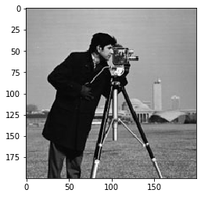
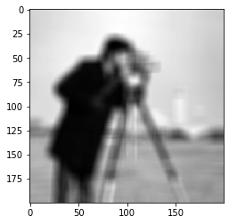

# Pybind OpenCV Mat wrapper
## `cv::Mat` <-> `np.array`

Very basic implementation of a pybind wrapper to conver a `numpy.array` into `cv::Mat` and the other way arround (`cv::Mat` to `numpy.array`).

## Build
Clone the repository, go to the projec folder then:

```$ pip install .```

This will compile and install the `cvMat` module in the currently active python environment.

You may want to specify which python interpreter you want the module to be compiled for. This can be done by editing the `CMakeLists.txt` file and specify the path to the interpreter in the set(`PYTHON_EXECUTABLE` [path]) line.

The `setup.py` file was taken from the [pybind cmake example code](https://github.com/pybind/cmake_example). Check the project's readme for building issues.

## Use example

```{python}
import cvMat
import numpy as np
import matplotlib.pyplot as plt
import imageio
%matplotlib inline

img = imageio.imread("photograph.png")
plt.imshow(img, cmap="gray");
```



```{python}
blur = cvMat.blur(img,kernel_size=11)
plt.imshow(blur, cmap='gray');
```



